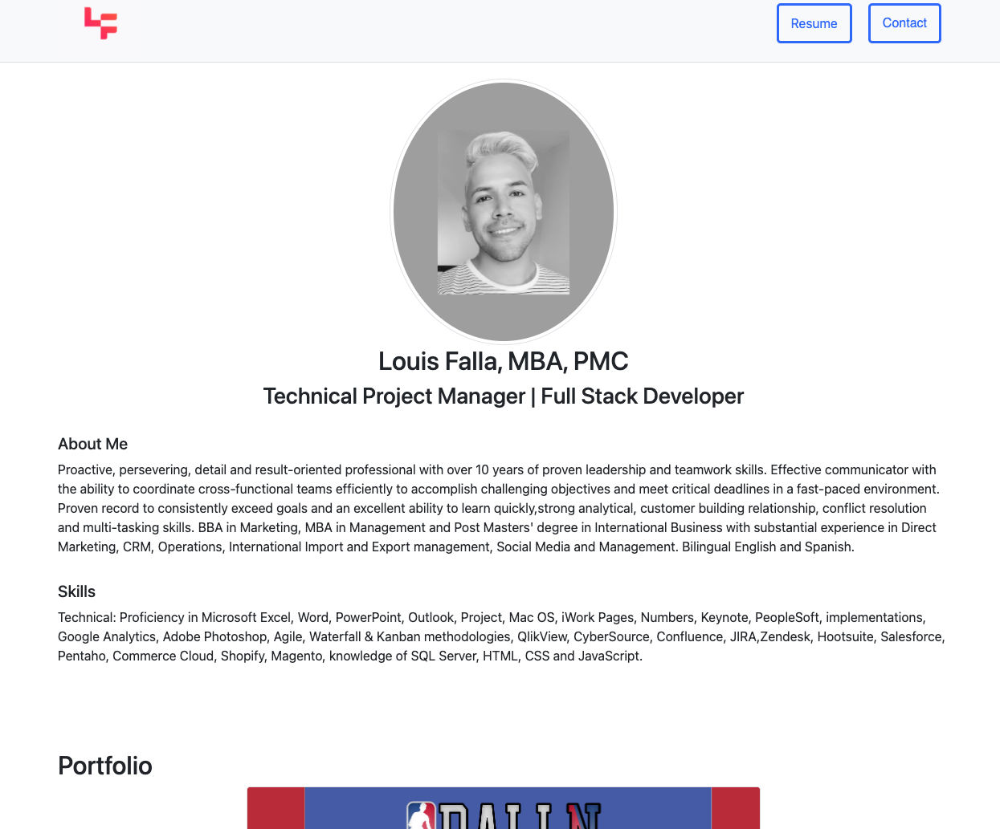

# Homework 08 -  Updated Portfolio 

## Link to site
* [Live Link](https://chronoslou.github.io/Updated-portfolio/)
* [Repo Link](https://github.com/chronoslou/Updated-portfolio)

## Description

This is my updated portfolio using everything that I have taught thus far. I am using bootstrap for css and external libraries. I also have added additional functionality and complete links to my projects. 

## Usage

The portfolio:

* Has the Links to my GitHub profile and LinkedIn page, as well as my email address and phone number

* A link to a PDF of my current resume

* A list of projects, each including; Project title, Link to the deployed version, Link to the GitHub repository, Screenshot of the deployed applications

* Site was to designed mobile-first.

## Preview of App 

* This is how the app looks

# Lincense
* MIT
